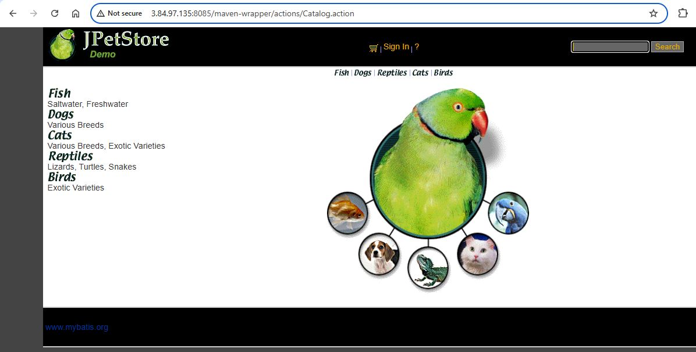

# CI/CD Pipeline Documentation for WAR Deployment to Tomcat

```bash
GitHub (Source Code Repository)
│
▼
Jenkins (CI/CD Orchestrator)
├── Pull code from GitHub (via Webhook or Poll SCM)
├── Maven Build (Compile + Unit Test + Package WAR)
├── SonarQube Code Analysis (Static Code Quality & Security Checks)
├── Archive artifacts (Optional: WAR file stored in Jenkins or Nexus)
└── Deploy WAR to Tomcat running on EC2 (App Server)
```

---

## 2. EC2 Servers Setup

| Purpose       | EC2 Type | OS           | Storage | Inbound Ports                 |
|---------------|----------|--------------|---------|-------------------------------|
| Jenkins       | t3.medium| Ubuntu 22.04 | 15 GB   | 8080 (Jenkins), 22 (SSH) ,8085 (Tomcat)     |
| SonarQube     | t3.medium| Ubuntu 22.04 | 15 GB   | 9000 (SonarQube), 5432 (DB), 22 |

---

## 3. Prerequisites and Configuration

### A. In Jenkins Server (Ubuntu 22.04)

#### Install below Packages on Jenkins server

**Install Java:**
```bash
sudo apt update
sudo apt install openjdk-21-jdk maven docker.io git unzip curl -y
```
**Install Jenkins:**
```bash
wget -q -O - https://pkg.jenkins.io/debian-stable/jenkins.io.key | sudo tee /usr/share/keyrings/jenkins-keyring.asc > /dev/null
echo deb [signed-by=/usr/share/keyrings/jenkins-keyring.asc] https://pkg.jenkins.io/debian-stable binary/ | sudo tee /etc/apt/sources.list.d/jenkins.list > /dev/null
sudo apt update
sudo apt install jenkins -y

# start Jenkins service
sudo systemctl start jenkins
sudo systemctl enable jenkins
```
**Install Tomcat:**
```bash
sudo apt update
sudo apt install tomcat9 -y
```
### B. In SonarQube Server (Ubuntu 22.04)
**Install SonarQube:**

```bash
# Update system packages
sudo apt update
sudo apt upgrade -y

# Install Java (required for SonarQube)
sudo apt install -y openjdk-17-jdk
java -version

# install PostgreSQL
sudo sh -c 'echo "deb http://apt.postgresql.org/pub/repos/apt/ `lsb_release -cs`-pgdg main" /etc/apt/sources.list.d/pgdg.list'
wget -q https://www.postgresql.org/media/keys/ACCC4CF8.asc -O - | sudo apt-key add -
sudo apt install postgresql postgresql-contrib -y
sudo systemctl enable postgresql
sudo systemctl start postgresql
sudo systemctl status postgresql
psql --version

# switch to Postgre user
sudo -i -u postgres

# Create user for SonarQube
createuser ddsonar

# login into PostgreSQL
psql

# Set a password for the ddsonar user. Use a strong password in place of my_strong_password.
ALTER USER [Created_user_name] WITH ENCRYPTED password 'my_strong_password';
# example
ALTER USER ddsonar WITH ENCRYPTED password 'mwd#2%#!!#%rgs';

# Create a SonarQube database and set the owner to ddsonar.
CREATE DATABASE [database_name] OWNER [Created_user_name];
# example
CREATE DATABASE ddsonarqube OWNER ddsonar;

# Grant all the privileges on the ddsonarqube database to the ddsonar user.
GRANT ALL PRIVILEGES ON DATABASE ddsonarqube to ddsonar;

# List databases and users
\l
\du

# Exit PostgreSQL and return to previous (root) user
\q
exit

# download and Install Sonarqube
sudo apt install zip -y
sudo wget https://binaries.sonarsource.com/Distribution/sonarqube/sonarqube-10.0.0.68432.zip
sudo unzip sonarqube-10.0.0.68432.zip
sudo mv sonarqube-10.0.0.68432 sonarqube
sudo mv sonarqube /opt/

# Add SonarQube Group and User
sudo groupadd ddsonar
sudo useradd -d /opt/sonarqube -g ddsonar ddsonar
sudo chown ddsonar:ddsonar /opt/sonarqube -R
```
**Configure SonarQube:**
```bash
# Edit the SonarQube Configurationfile:
sudo vi /opt/sonarqube/conf/sonar.properties

# Update the following lines (uncomment and modify as needed) and save the file:
sonar.jdbc.username=ddsonar
sonar.jdbc.password=mwd#2%#!!#%rgs
sonar.jdbc.url=jdbc:postgresql://localhost:5432/ddsonarqube

# Edit the sonar script file.
sudo vi /opt/sonarqube/bin/linux-x86-64/sonar.sh
# Add the following line in top after bash line then save the file
RUN_AS_USER=ddsonar
```

**Setup Systemd service:**
```bash
# Create a systemd service file to start SonarQube at system boot.
sudo vi /etc/systemd/system/sonar.service

# Paste the following lines to the file and save the file.
[Unit]
Description=SonarQube service
After=syslog.target network.target
[Service]
Type=forking
ExecStart=/opt/sonarqube/bin/linux-x86-64/sonar.sh start
ExecStop=/opt/sonarqube/bin/linux-x86-64/sonar.sh stop
User=ddsonar
Group=ddsonar
Restart=always
LimitNOFILE=65536
LimitNPROC=4096
[Install]
WantedBy=multi-user.target

Note: Here in the above script, make sure to change the User and Group section with the value that you have created.
# Enable the SonarQube service to run at system startup.
sudo systemctl enable sonar

# Start the SonarQube service.
sudo systemctl start sonar

#Check the service status.
sudo systemctl status sonar
```

**Modify Kernel System Limits:**
```bash
# SonarQube uses Elasticsearch to store its indices in an MMap FS directory. It requires some changes to the system defaults.
# Edit the sysctl configuration file.
sudo nano /etc/sysctl.conf

# Add the following lines and save the file.
vm.max_map_count=262144
fs.file-max=65536
ulimit -n 65536
ulimit -u 4096

# Reboot the system to apply the changes.
sudo reboot
```

**Access SonarQube Web Interface:**
```bash
# Access SonarQube in a web browser at your server’s IP address on port 9000.
For example, http://IP:9000

# Change the Old password with a New one.
Log in with username `admin` and password `admin`. In the next step, SonarQube will prompt you to change your password. `CHANGE THE PASSWORD`.
```
**Our SonarQube has been installed successfully.**

## 3. Jenkins Configuration:

### Configure Global Tools
- Maven: `Maven3` (point to: `/usr/share/maven`)
- JDK: `java-21` (point to: `/usr/lib/jvm/java-21-openjdk-amd64`)

### Install plugins
- Docker Pipeline
- Pipeline
- Pipeline view
- SonarQube Scanner
- SSH Agent

### Global tool configuration

**SonarQube:**
- Name: SonarQube
- Server URL: http://<SonarQube-IP>:9000
- Token: Add via Jenkins Credentials (Secret Text)

## 4. Jenkinsfile (Declarative Pipeline):

```bash
pipeline {
    agent any

    environment {
        SONAR_HOST_URL = 'http://3.88.47.160:9000'
    }

    stages {
        stage('Checkout Code') {
            steps {
                git branch: 'MockProject-demo', 
                    url: 'https://github.com/amanoj553/Cisco_FullStack_MockProject.git'
            }
        }
        stage('Unit Test') {
            steps {
                sh 'mvn test'
            }
        }
        stage('SonarQube Analysis') {
            steps {
                withSonarQubeEnv('SonarQube') {
                    //sh 'sonar-scanner -Dsonar.projectKey=your-key -Dsonar.sources=src -Dsonar.java.binaries=target'
                    // sh 'sonar-scanner'
                    sh 'mvn sonar:sonar'
                }
            }
        }
        stage('Build WAR') {
            steps {
                sh 'mvn clean package -DskipTests'
            }
        }
        stage('Deploy WAR') {
            steps {
                script {
                    // Define source WAR file path
                    def warFile = sh(script: "ls target/*.war", returnStdout: true).trim()
                    
                    // Define Tomcat webapps path (update it as per your Tomcat installation)
                    def tomcatWebappsPath = "/var/lib/tomcat9/webapps/"
        
                    // Copy WAR to Tomcat's webapps directory
                    sh "chmod 755 ${warFile}"  
                    sh "sudo cp ${warFile} ${tomcatWebappsPath}/"
        
                    // Optional: Restart Tomcat if auto-deploy is not enabled
                     sh "sudo systemctl restart tomcat9"
                }
            }
        }
    }
}

```


## 5. Application test:

**Goto browser and check with below URL**
- [http://<App-Server-IP>:8085/maven-wrapper/]

  




## 6. Troubleshooting Tips:

**SonarQube not loading?**
- Ensure `java` is version 17+ on SonarQube server
- Verify PostgreSQL is running
- check the sonarqube logs for more details
- check the server memory also some times insufficient also not running
